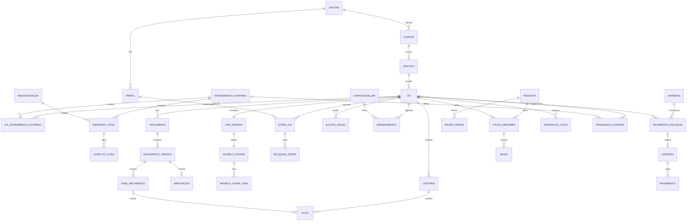

# Painel D doctor — Arquitetura técnica (v2)

> Documento derivado de `docs/espec-dono-v1.md` (voz do dono), corrigido por `docs/maxpar-estudo.md`, encaixado sobre o que já existe em `codigo/painel/` (Sprint 0) e sobre o `docs/painel-plano.md`. Data: 02/10/2026. Destina-se ao desenvolvedor trabalhando com Claude Code no VS Code. Não contém código de aplicação; contém contratos, tabelas, diagramas e sequência.
>
> **Regra de leitura:** tudo que se refere ao conteúdo, telas, campos ou exportações da Maxpar é **hipótese** até a inspeção autorizada da conta da oficina (portão G1, seção 10). Nada aqui autoriza escrita na Maxpar.

---

## 1. Visão geral e princípios

### 1.1 O que o painel é e não é

| É | Não é |
| --- | --- |
| Sistema interno da oficina: do carro que chega ao dinheiro que entra (orçamento, agenda, vistoria, produção, estoque, recebíveis, financeiro). | Substituto da Maxpar. A conversa obrigatória com a seguradora (autorização, encerramento "Serviço Realizado", documentação, pagamento) continua no portal da Maxpar. |
| Espelho local, com proveniência, do que a Maxpar mostra à oficina. | Fonte de verdade sobre o que a Maxpar decidiu. |
| Mestre de tudo que a oficina decide: etapas, prazos, agenda, fotos internas, estoque, caixa. | Sistema de orçamentação de sinistro de casco (Audatex/Cilia). Fora de escopo por evidência. |

### 1.2 Quem é mestre de quê

| Domínio | Mestre | O painel faz |
| --- | --- | --- |
| Existência do atendimento, seguradora, protocolo, peças autorizadas, valor autorizado, status externo, fotos exigidas pela Maxpar | **Maxpar** | Importa (leitor), guarda snapshot com data/origem, nunca "corrige" o externo; divergência vira conflito para humano. |
| Cliente, veículo (dados de contato e identificação) | **Painel**, semeado pela Maxpar quando disponível | Preserva por campo: fonte, data, validado por quem. Importação não sobrescreve campo validado localmente. |
| OS, orçamento interno/rascunho, tipo de reparo, etapas, prazos, responsáveis, agenda, capacidade | **Painel** | Mestre absoluto; auditado. |
| Vistorias e fotos internas | **Painel** (Storage privado) | Fotos importadas da Maxpar ficam marcadas `origem = maxpar`. |
| Estoque, recebíveis, despesas, caixa | **Painel** | Mestre; só efetivo após baixa/pagamento. |
| Ações exigidas no portal (encerramento, reenvio de documentação) | **Humano no portal Maxpar** | Gera pendência, registra confirmação manual. V1 não escreve na Maxpar. |
| Agendamento por WhatsApp | **Painel** decide vagas; **Calia** conversa | Calia só propõe horários que o painel devolveu como disponíveis. |

### 1.3 Princípios de arquitetura

1. **Nada da Maxpar é fato até a inspeção.** Todo campo externo carrega `fonte`, `lido_em`, `hash` e o bruto original. O leitor de portal só é construído depois do portão G1.
2. **Fluxo interno completo antes de qualquer integração.** O painel tem de funcionar 100 % com cadastro manual (critério de aceitação da espec).
3. **Uma porta de dados.** Componentes só falam com `Repositorio` (já é regra do `CLAUDE.md`; o Sprint 0 violou na leitura — dívida da QA, corrigida no Sprint 1).
4. **Regras de negócio em TypeScript puro, testadas com Vitest**, em `src/dominio/`. O banco guarda; o domínio decide. Exceções: reserva atômica de vaga e auditoria por trigger, que precisam da transação do Postgres.
5. **Backend real já no próximo ciclo** (autenticação individual, papéis, fotos privadas, auditoria, worker). Supabase cobre o BaaS; um worker Node separado cobre Playwright e Calia.
6. **Idempotência em toda entrada externa** (Maxpar, Calia, arquivo): chave natural + hash de conteúdo.
7. **Operate mode na UI** (DESIGN.md/CLAUDE.md): clareza, tabela/kanban/formulário; TV e celular são superfícies de primeira classe.
8. **Isolar por `oficina_id` desde o início** mesmo com uma oficina: custo zero agora, evita refatoração se o irmão abrir outra unidade ou se o painel for oferecido a terceiros.

---

## 2. Arquitetura de componentes

### 2.1 Diagrama

```
┌──────────────────────────── Dispositivos da oficina ────────────────────────────┐
│  PC recepção (navegador)   Celular dono/gestor   Celular/tablet funcionário   TV │
└───────────┬───────────────────────┬─────────────────────┬───────────────────┬────┘
            │ HTTPS                 │                     │                   │
            ▼                       ▼                     ▼                   ▼
┌─────────────────────────────────────────────────────────────────────────────────┐
│  FRONTEND  Vite + React 19 + TS + Tailwind v4  (SPA)                            │
│  rotas: /geral /orcamentos /agenda /vistorias /producao /producao/tv            │
│         /producao/eu (celular) /funcionarios /estoque /recebiveis /financeiro   │
│  camadas: telas → hooks (TanStack Query) → Repositorio{Supabase|Memoria}        │
│  hospedagem: Cloudflare Pages (recomendado) ou GitHub Pages (atual, hash)       │
└───────────┬──────────────────────────────────────────────────────┬──────────────┘
            │ supabase-js (anon key + JWT do usuário; RLS)         │ Realtime (TV, produção)
            ▼                                                      ▼
┌─────────────────────────────────────────────────────────────────────────────────┐
│  SUPABASE (projeto único, região sa-east-1 São Paulo)                           │
│  ├─ Postgres: esquema v2 (seção 6), RLS por oficina_id + papel, triggers de     │
│  │   auditoria, funções SQL: reservar_vaga(), concluir_etapa(), aplicar_baixa() │
│  ├─ Auth: e-mail+senha; perfis com papel; conta "dispositivo" p/ TV e terminal  │
│  ├─ Storage: bucket privado `fotos` (URLs assinadas, 10 min); `exportacoes`     │
│  ├─ Edge Functions: webhook Calia (HMAC), disponibilidade p/ Calia,             │
│  │   exportação CSV/PDF, convite de usuário, redefinição de PIN de terminal      │
│  └─ Realtime: canais `producao:{oficina}` e `agenda:{oficina}`                  │
└───────────┬──────────────────────────────────────────────────────┬──────────────┘
            │ service-role key (só no worker; nunca no front)       │ fila (tabela `job`)
            ▼                                                      │
┌─────────────────────────────────────────────────────────────────────────────────┐
│  WORKER DE INTEGRAÇÃO  Node 22 + TypeScript (processo separado, sem UI)         │
│  ├─ Agendador (cron) + consumidor da tabela `job` (SKIP LOCKED)                 │
│  ├─ MaxparReader: PortalReader (Playwright, só após G1) | ArquivoReader |        │
│  │   ManualReader (passthrough) | OfficialApiReader (futuro)                     │
│  ├─ Normalizador + Conciliador (hash/snapshot → diff → conflito)                │
│  ├─ CaliaClient (adaptador; API desconhecida → modo manual até G3)              │
│  ├─ Backup: pg_dump semanal + espelho do Storage → disco da oficina/Drive       │
│  └─ Segredos: variáveis de ambiente do host; sessão do portal cifrada em disco  │
│  hospedagem: PC/mini-PC da oficina (piloto) → Fly.io/Railway/Render (opcional)  │
└───────────┬───────────────────────────────┬─────────────────────────────────────┘
            │ navegador autenticado          │ HTTPS (contrato seção 8.3)
            ▼                                ▼
   ┌─────────────────────┐          ┌───────────────────┐        ┌──────────────────┐
   │ Portal Maxpar       │          │ Calia (WhatsApp)  │        │ Ponto eletrônico │
   │ (Área do Credenciado│          │ API desconhecida  │        │ fornecedor futuro│
   │  ou Portal do       │          │                   │        │ (LeitorPonto)    │
   │  Prestador — G1)    │          └───────────────────┘        └──────────────────┘
   └─────────────────────┘
```

### 2.2 Peças, escolhas e custo (faixas, não promessas; câmbio ~R$ 5,5/US$)

| Peça | Escolha | Por quê | Alternativa | Custo mensal aprox. |
| --- | --- | --- | --- | --- |
| Frontend | Vite + React 19 + TS + Tailwind v4 (já existe) | Sprint 0 pronto; identidade do DESIGN.md já aplicada. | — | R$ 0 |
| Hospedagem front | **Cloudflare Pages** (recomendado a partir do Sprint 2) com `BrowserRouter` e fallback SPA; subdomínio próprio | Rotas limpas (`/producao/tv`), cabeçalhos de segurança via `_headers`, URL de redirecionamento estável para o Auth, deploy por push. GitHub Pages continua para a landing. | Manter GitHub Pages + HashRouter (funciona com fluxo PKCE do Supabase; sem cabeçalhos CSP; repositório público). Vercel (igual ao Cloudflare, limite de banda no plano gratuito). | R$ 0; domínio `.com.br` R$ 40–60/ano |
| BaaS | **Supabase** (Postgres + Auth + Storage + RLS + Edge Functions + Realtime), região São Paulo | Cobre todos os requisitos da espec (auth individual, papéis via RLS, fotos privadas, auditoria em SQL, realtime para TV) num só fornecedor; CLI local (`supabase start`) permite desenvolver sem conta. | Firebase (sem SQL relacional, RLS mais fraca para financeiro); Pocketbase/Node próprio (mais operação). | Free (dev/piloto; projeto pausa após 7 dias sem uso) → **Pro US$ 25 ≈ R$ 140–160** em produção (sem pausa, backups diários 7 dias, 8 GB banco, 100 GB storage) |
| Worker | **Node 22 + TS**, processo único com cron e fila em tabela Postgres | Playwright não roda em Edge Function (tempo, memória, Chromium). Calia precisa de cliente com segredo. Backups precisam de `pg_dump`. | Edge Functions apenas (não serve para Playwright). | ver linha de hospedagem |
| Hospedagem worker | **Piloto: PC/mini-PC da oficina** (Docker ou pm2). **Depois:** Fly.io (máquina 1 GB) ou Railway/Render | Ler o portal a partir do mesmo IP residencial que a oficina já usa é menos propenso a bloqueio do que um IP de datacenter; custo zero. Nuvem quando a confiabilidade importar mais. | Só nuvem desde o início. | Oficina: R$ 0 (+ energia). Fly.io 1 GB: US$ 5–12 ≈ R$ 30–70. Railway Hobby US$ 5 + uso ≈ R$ 30–60. Render Starter US$ 7 ≈ R$ 40. |
| Fotos | Supabase Storage, bucket privado, URLs assinadas, miniaturas geradas no upload (cliente, ≤ 1600 px) | Permissão por papel via política de Storage; sem URL pública. | Cloudflare R2 (mais barato em volume; exige mais código). | Incluído no Pro até 100 GB (≈ 50–80 mil fotos a 1,5 MB); excedente US$ 0,021/GB |
| Auth e papéis | Supabase Auth (e-mail+senha) + tabela `perfil(papel)` + RLS; convite por e-mail; conta "dispositivo" para TV/terminal com PIN por funcionário validado em Edge Function | Autenticação individual exigida pela espec; terminal compartilhado da produção sem exigir e-mail de cada funileiro. | OTP por SMS (custo por mensagem; Supabase cobra via Twilio). | R$ 0 (e-mail transacional: Supabase embutido tem limite baixo; Resend grátis até 3 mil/mês) |
| Auditoria | Tabela `evento_auditoria` preenchida por triggers nas tabelas sensíveis + inserções explícitas do worker | Não depende de o front "lembrar" de auditar. | Só na aplicação. | R$ 0 |
| E-mail | Resend (ou SMTP próprio) ligado ao Supabase Auth | Convites, redefinição de senha, alertas de sincronização. | — | R$ 0 na faixa gratuita |
| Calia | Cliente HTTP no worker + webhook em Edge Function | API desconhecida; isolar em adaptador. | — | Depende do contrato do dono com a Calia (G3) |
| **Total** | | | | **Piloto: R$ 0–70/mês. Produção: R$ 170–280/mês** (sem Calia) |

### 2.3 Estrutura de repositório proposta

```
codigo/painel/                 frontend (existente)
  src/dominio/                 tipos v2, regras, máquinas de estado, semáforo, rótulos (+ testes)
  src/dados/                   Repositorio (interfaces por agregado), RepositorioSupabase, RepositorioMemoria, hooks
  src/telas/{geral,orcamentos,agenda,vistorias,producao,funcionarios,estoque,recebiveis,financeiro,ajustes}/
codigo/worker/                 Node: leitores Maxpar, Calia, fila, backup (novo)
codigo/supabase/               migrations/, functions/ (Edge), seed.sql, policies (novo; `supabase init`)
codigo/compartilhado/          pacote TS com tipos do domínio e contratos (importado por painel e worker)
```

---

## 3. De onde vêm os dados (origens)

Derivado da matriz da espec (§4), corrigido pelo estudo: a Maxpar é gestora de **assistências** (teto de mão de obra, franquia paga na oficina, peças do segurado, autorização **por peça**), não plataforma de sinistro. Portanto o "orçamento externo" é na prática a **lista de peças solicitadas × autorizadas com valor de mão de obra**, e a "aprovação" é a **autorização por peça**.

Legenda de origem: **M** = Maxpar (leitor portal/arquivo/manual), **R** = recepção/orçamentista, **G** = gestor/dono, **P** = produção (funcionário), **F** = financeiro, **C** = Calia, **S** = sistema (derivado).

| Entidade / dado | Origem | Gatilho | Regra de conflito e proveniência |
| --- | --- | --- | --- |
| `atendimento_externo` (protocolo, seguradora, produto, status bruto, datas, data-limite de vistoria) | M → cópia | Sincronização programada/manual ou digitação na recepção | Chave `(oficina_id, seguradora, id_externo)`. Sem `id_externo` confiável → registro fica `pendente_conciliacao` e aparece na fila de conciliação. Alteração externa gera novo `snapshot_sync`; status externo nunca é editado localmente, só anotado. |
| `cliente` (nome, telefone, e-mail) | M quando disponível → R completa | Importação cria/sugere; recepção valida | Proveniência por campo (`fonte`, `lido_em`, `validado_por`). Importação só preenche campo vazio ou não validado. Deduplicação por telefone normalizado + nome aproximado, com confirmação humana. |
| `veiculo` (placa, modelo, cor, ano) | M → R | Idem | Placa é índice de busca, não chave. Mesmo veículo, N OS. Protocolo com "carro errado" (dor real do estudo) vira conflito, não sobrescrita. |
| `orcamento_versao` externa + `item_orcamento` (peça, técnica, valor autorizado, status por peça) | M → snapshot | Qualquer mudança detectada por hash | Cada mudança externa = nova versão `fonte = maxpar`, imutável. Aprovação parcial por peça preservada item a item. |
| `aprovacao` externa (autorização) | M | Idem | Aponta para a versão exata. Divergência entre aprovação externa e rascunho interno **bloqueia disparo Calia** e abre alerta. |
| `orcamento_versao` interna (rascunho, particular, complemento acima do teto) | R | Edição na aba Orçamentos | Mestre painel. Nunca marcada como "enviada à Maxpar" automaticamente; envio é pendência externa confirmada por humano. |
| `foto` externa | M | Sincronização | Dedupe por SHA-256 dos bytes; `origem = maxpar`, `ref_externa`. |
| `os`, `tipo_reparo`, `etapa_os` (prazos, responsáveis, previsão global) | G (R pode abrir) | Abertura/ajuste da OS; entrada física | Mestre painel. Toda mudança de prazo: autor, antes/depois, motivo (auditoria). Modelo sugere; gestor ajusta por carro. |
| `agendamento`, `capacidade_dia`, `bloqueio` | R/G/C | Ação humana ou retorno da Calia | Reserva atômica no Postgres (`reservar_vaga`). Reagendar libera a vaga anterior na mesma transação. Proposta da Calia tem validade (TTL) e expira. |
| `vistoria` + `foto` interna | P/R | Marcos da OS (entrada, durante, final) | Guarda OS, fase, autor, data, dispositivo. Fotos externas e internas nunca se misturam no mesmo registro. |
| `etapa_os` eventos (fila, início, fim, bloqueio, peças executadas) | P | Botões da tela do celular | Só o responsável ou o gestor altera; tempo em fila e em execução medidos separadamente (seção 7.4). |
| `material`, `movimento_estoque` | G | Lançamento manual (compra, uso estimado, conferência, ajuste) | Saldo = soma dos movimentos (estimativa). Compra pode criar `despesa` vinculada **uma vez**; uso não gera caixa. |
| `pagador`, `regra_prazo`, `titulo_receber`, `baixa` | G/F | Emissão de NF, correção, recebimento | Vencimento calculado pela regra do pagador na emissão; recálculo só com motivo. Baixa parcial permitida; caixa só após baixa. Franquia (pagador = cliente) e mão de obra (pagador = Maxpar/seguradora) são **títulos separados**. |
| `despesa`, `pagamento` | G/F | Lançamento e pagamento | Previsto separado de realizado. |
| `interacao_calia` | S → C → S | `aprovacao_confirmada`, resposta do cliente | Chave `(os_id, finalidade, versao)`; estados na seção 8.3. |
| `pendencia_externa` (encerramento no portal, reenvio de documentação, reanálise de peça) | S gera, humano conclui | Marcos da OS; recusa registrada | Nunca aparece como "sincronizada" sem confirmação humana com data e autor. |
| `marcacao_ponto` | Fornecedor futuro | Integração futura | Fora da V1; interface `LeitorPonto` reservada. |
| `evento_auditoria`, `sincronizacao`, `snapshot_sync`, `conflito_sync` | S | Triggers e worker | Imutáveis (sem UPDATE/DELETE para qualquer papel). |

---

## 4. Para onde vão os dados (destinos e saídas)

| Saída | Formato / canal | Quem recebe | Gatilho | Observação |
| --- | --- | --- | --- | --- |
| Pendências externas (checklist do portal) | Lista na aba Geral e na ficha da OS; opcional e-mail diário ao gestor | Funcionário designado | OS pronta/entregue; recusa de documentação; peça fora da autorização | Humano executa no portal e marca "concluída" com data. É o substituto da escrita na Maxpar na V1. |
| Mensagens para a Calia | HTTP (contrato 8.3) via worker | Calia → cliente final | `aprovacao_confirmada` com telefone válido e regra de contato satisfeita | Enquanto não houver API (G3): modo manual, texto pronto para a recepção copiar. |
| Disponibilidade de agenda para a Calia | Endpoint (Edge Function) consultado pela Calia | Calia | Pedido da Calia | Devolve apenas vagas com capacidade real; reserva com TTL. |
| Exportações | CSV (recebíveis, financeiro, estoque, OS por período), PDF (ficha da OS com fotos, extrato por seguradora, "Impressão de serviço" interno) | Dono/financeiro/contador | Botão nas abas | Gerado por Edge Function, salvo no bucket `exportacoes` com URL assinada (expira). |
| Backups | `pg_dump` semanal + espelho do Storage, cifrados, para disco da oficina/Drive do dono; backups diários do Supabase Pro | Dono | Cron no worker | Teste de restauração a cada trimestre (seção 9.4). |
| Alertas operacionais | E-mail (e WhatsApp via Calia, se contratado) ao gestor | Gestor | Sincronização falhando N vezes, conflito aberto > 48 h, vaga estourada | Sem dados pessoais no corpo do alerta. |
| Tela da TV | Realtime (sem interação) | Produção | Qualquer mudança em `etapa_os`/`os` | Dados mínimos: placa, veículo, etapa, responsável, tempos, cor. Sem valores, sem telefone. |

**O que a V1 explicitamente NÃO faz**

- Não escreve nada na Maxpar (nenhum formulário, upload ou mudança de status no portal). Qualquer necessidade de escrita vira `pendencia_externa`.
- Não envia WhatsApp direto ao cliente fora da Calia (nem via API da Meta); a oficina continua com o WhatsApp dela.
- Não contorna CAPTCHA, MFA, limite de taxa ou bloqueio do portal. Se ocorrer, o worker para, registra `sincronizacao.estado = bloqueada` e avisa o gestor.
- Não emite NF (registra número, data e valor da NF emitida fora). Emissão fiscal é decisão futura.
- Não calcula folha nem comissão como obrigação financeira (mostra produtividade; comissão só como indicador se o dono informar a regra).

---

## 5. Onde os dados são expostos (superfícies)

Menu da espec. Papéis: **D** dono, **G** gestor, **R** recepção/orçamentista, **P** produção, **F** financeiro, **TV** dispositivo. Estados obrigatórios em toda tela: carregando, vazio, erro (com ação "tentar de novo"), sem permissão, "dado externo desatualizado" quando `lido_em` > limite.

| Aba / rota | Acessa | Mostra | Ações | Fonte (tabela/consulta) |
| --- | --- | --- | --- | --- |
| **Geral** `/geral` | D, G (R e F veem recorte do seu módulo) | Entradas hoje/semana, carros na oficina, entregas previstas hoje, atrasados (vermelho), recebíveis vencidos e a vencer 7/30 dias, saldo realizado do mês, pendências externas abertas, saúde da sincronização (última leitura, falhas) | Cada indicador abre a lista filtrada correspondente; nenhuma edição direta | Views `vw_geral_*` (agregações sobre `os`, `agendamento`, `etapa_os`, `titulo_receber`, `pagamento`, `pendencia_externa`, `sincronizacao`) |
| **Orçamentos** `/orcamentos`, `/orcamentos/:osId` | R, G, D (F só valores) | Lista de casos por estado (rascunho, aguardando, aprovado, recusado, aguardando agendamento); ficha: cliente/veículo, atendimentos externos vinculados com status bruto + `lido_em`, versões lado a lado (externa × interna), itens por peça/técnica/valor, fotos, aprovação apontando para versão, conflitos abertos | Criar OS a partir de atendimento externo ou do zero; nova versão interna; registrar aprovação manual (com evidência); vincular/desvincular atendimento externo (conciliação); enviar à fila de agenda; abrir pendência externa | `os`, `os_atendimento_externo`, `atendimento_externo`, `orcamento_versao`, `item_orcamento`, `aprovacao`, `conflito_sync`, `foto` |
| **Agenda** `/agenda` | R, G, D | Semana atual/próxima por dia: vagas usadas/total, bloqueios, entradas confirmadas, propostas pendentes (com TTL), fila "aguardando agendamento" com telefone validado e estado Calia | Agendar/reagendar/cancelar (reserva atômica); registrar não comparecimento; criar bloqueio; editar capacidade do dia; disparar/parar contato Calia; assumir caso da Calia | `agendamento`, `capacidade_dia`, `bloqueio`, `interacao_calia`, função `reservar_vaga` |
| **Vistorias** `/vistorias`, `/vistorias/:osId` | R, G, P (apenas OS atribuídas), D | Galeria por OS → fase (entrada, durante, final, externa) com autor/data/origem; formulário de vistoria (danos por peça, observações) | Tirar/enviar foto (celular, câmera direta), legenda, excluir própria foto em 10 min, marcar peça/dano | `vistoria`, `foto` (Storage), `item_orcamento` para vincular dano a peça |
| **Produção** `/producao` | G, D, R (leitura) | Kanban por etapa com cartões: placa, veículo, tipo de reparo, etapa atual, responsável, prazo da etapa, previsão global, cor do semáforo, impedimento ativo, tempo em fila/execução | Atribuir responsável; ajustar prazo com motivo; bloquear/dispensar etapa com motivo; reordenar prioridade; abrir ficha | `os`, `etapa_os`, `bloqueio_etapa`, `modelo_etapas`, view `vw_producao` |
| **Produção — TV** `/producao/tv` | TV (dispositivo), G | Cartões grandes agrupados por etapa ou por urgência: placa, veículo, serviço, etapa, responsável, peças feitas/previstas, tempo em fila, tempo em execução, previsão, cor. Filtros fixos por URL: `?filtro=atrasados|hoje|impedidos`. Rodapé com hora da última atualização | Nenhuma (somente leitura, sem foco de teclado); relógio e rotação automática de filtros opcional | `vw_producao` via Realtime; sem valores financeiros nem telefones |
| **Produção — celular** `/producao/eu` | P (login individual ou terminal + PIN), G | "Minhas tarefas": etapas atribuídas a mim, ordenadas por prazo/cor; detalhe com peças previstas e checklist | **Iniciar**, **Concluir** (com contagem de peças e foto quando a etapa exige), **Informar impedimento** (motivo), **Retomar**; só sobre as próprias etapas | `etapa_os` filtrada por `responsavel_id`, função `concluir_etapa` |
| **Funcionários** `/funcionarios` | D, G | Por pessoa e período: etapas concluídas, peças, carros, tempo médio em execução, impedimentos informados; indicador de comissão só se regra informada | Cadastrar funcionário, papel, PIN de terminal, ativar/desativar | `usuario`, `perfil`, `etapa_os` agregada, `regra_comissao` (opcional) |
| **Estoque** `/estoque` | D, G | Materiais com saldo estimado, mínimo, última conferência; movimentos | Compra (opcionalmente gera despesa), uso estimado por OS, conferência, ajuste | `material`, `movimento_estoque`, `despesa` |
| **Recebíveis** `/recebiveis` | F, D, G | Títulos por pagador (seguradora/Maxpar/cliente), estado, NF, vencimento, aging (0–30/31–60/61+), baixas parciais | Criar título a partir da OS (sugestão automática: franquia + mão de obra autorizada + complemento), registrar NF, baixa parcial/total, recalcular vencimento com motivo, exportar CSV/PDF | `titulo_receber`, `baixa`, `pagador`, `regra_prazo`, função `aplicar_baixa` |
| **Financeiro** `/financeiro` | F, D | Despesas previstas × pagas, recebimentos, saldo realizado do período, projeção (recebíveis a vencer − despesas previstas), por categoria e por seguradora | Lançar despesa, pagar, categorizar, exportar | `despesa`, `pagamento`, `baixa`, views `vw_caixa_*` |
| **Folha/ponto** `/folha` | D (futuro) | Placeholder explícito "fora da V1" | — | `marcacao_ponto` (reservada) |
| **Ajustes** `/ajustes` | D, G | Tipos de reparo e modelos de etapas, limiares do semáforo, capacidade padrão, regras de prazo por pagador, regras de contato Calia, usuários e papéis, sincronização (botão sincronizar, log, fila de erros, conflitos), backups, retenção | Editar configurações (auditadas) | `config_oficina`, `tipo_reparo`, `modelo_etapas`, `regra_prazo`, `sincronizacao`, `conflito_sync` |

Correspondência com as telas do Sprint 0: `Patio` → Produção; `Atendimentos`/`Ficha` → Orçamentos (ficha da OS); `Pendencias` → bloco de pendências do Geral + lista de `pendencia_externa`; `Agenda` → Agenda; `Financeiro` → Recebíveis + Financeiro; `Ajustes` permanece.

---

## 6. Modelo de dados v2

### 6.1 Convenções

- Todas as tabelas: `id uuid`, `oficina_id uuid`, `criado_em`, `atualizado_em`, `criado_por` (uuid do usuário ou `'worker'`). Soft delete só onde faz sentido (`arquivado_em`); auditoria e sincronização são imutáveis.
- Proveniência de campo (cliente/veículo): coluna JSONB `proveniencia` `{campo: {fonte, lido_em, validado_por, validado_em}}`.
- Dinheiro em `numeric(12,2)`; datas de negócio em `date`; marcos em `timestamptz`.
- Enums como tipos Postgres **e** uniões TS em `codigo/compartilhado/` (fonte única; migração gera ambos).

### 6.2 Entidades e campos principais

| Entidade | Campos principais | Chaves / unicidade |
| --- | --- | --- |
| `oficina` | nome, fuso, config (JSONB: semáforo, capacidade padrão, retenção) | PK |
| `usuario` / `perfil` | `auth.users.id`, nome, papel (`dono|gestor|recepcao|producao|financeiro|dispositivo`), ativo, pin_hash (só produção/terminal) | `perfil.id = auth.uid()` |
| `cliente` | nome, telefone_e164, email, documento (opcional, cifrado), proveniencia | índice por telefone |
| `veiculo` | cliente_id (nullable: veículo pode trocar de dono), placa_normalizada, modelo, cor, ano, chassi (opcional), proveniencia | índice por placa; **não** único |
| `atendimento_externo` | fonte (`maxpar_portal|maxpar_arquivo|manual|api`), seguradora, id_externo, numero_sinistro, produto, status_bruto, status_normalizado, abertura_em, limite_vistoria_em, previsao_portal, dados_brutos JSONB, ultimo_snapshot_id, lido_em, estado_conciliacao (`ok|pendente|conflito`) | **UNIQUE (oficina_id, seguradora, id_externo)** quando id_externo não nulo; parcial |
| `os` | veiculo_id, cliente_id, tipo_reparo_id, origem (`maxpar|seguradora_direta|particular|misto`), estado (6.3), prioridade, previsao_entrega, entrada_real_em, pronta_em, entregue_em, box, observacoes | número sequencial legível `numero` por oficina |
| `os_atendimento_externo` | os_id, atendimento_externo_id, papel (`principal|complementar`) | UNIQUE (os_id, atendimento_externo_id) |
| `orcamento` | os_id, tipo (`externo|interno`) | 1 externo por atendimento externo vinculado; N internos |
| `orcamento_versao` | orcamento_id, numero_versao, fonte, estado (6.3), total_mao_obra, total_pecas, teto_cobertura, franquia_valor, complemento_particular, hash_conteudo, snapshot_id (se externa), criado_por | UNIQUE (orcamento_id, numero_versao) |
| `item_orcamento` | versao_id, peca, tecnica (`sra|martelinho|pintura|funilaria|polimento|outro`), descricao, valor, status_item (`solicitado|autorizado|negado|reanalise|dispensado`), ref_externa | |
| `aprovacao` | versao_id, tipo (`externa|interna|cliente`), aprovado_em, evidencia (texto/foto), registrado_por, confiavel bool | 1 por versão |
| `tipo_reparo` / `modelo_etapas` / `modelo_etapa_item` | nome; ordem, nome_etapa, prazo_padrao_horas, dispensavel, exige_foto, exige_contagem_pecas, dias_uteis bool | |
| `etapa_os` | os_id, ordem, nome, estado (6.3), responsavel_id, prazo_horas, prazo_em, entrou_fila_em, iniciada_em, concluida_em, pecas_previstas, pecas_feitas, motivo_dispensa, origem_prazo (`modelo|ajuste`) | UNIQUE (os_id, ordem) |
| `bloqueio_etapa` | etapa_os_id, inicio_em, fim_em, motivo, registrado_por | |
| `ajuste_prazo` | os_id, etapa_os_id (nullable = prazo global), antes, depois, motivo, autor | |
| `capacidade_dia` | data, vagas_entrada, carros_simultaneos_max | UNIQUE (oficina_id, data); padrão vem de config |
| `bloqueio_agenda` | data_inicio, data_fim, recurso (nullable), motivo | |
| `agendamento` | os_id, data, janela (`manha|tarde|hora`), hora, estado (6.3), origem (`recepcao|calia|cliente`), expira_em (propostas), substitui_id (reagendamento), motivo_cancelamento | índice (data, estado) |
| `vistoria` | os_id, fase (`entrada|durante|final|externa`), autor_id, realizada_em, observacoes, danos JSONB | |
| `foto` | vistoria_id, os_id, storage_path, sha256, largura, altura, legenda, item_orcamento_id (nullable), origem (`interna|maxpar`), ref_externa, autor_id, dispositivo | UNIQUE (oficina_id, sha256) |
| `material` / `movimento_estoque` | nome, unidade, saldo_minimo; tipo (`compra|uso_estimado|conferencia|ajuste`), quantidade, custo_unitario, os_id (nullable), despesa_id (nullable) | |
| `pagador` / `regra_prazo` | nome, tipo (`seguradora|maxpar|cliente|outro`); dias, base (`nf|entrega|servico_realizado`), dias_uteis bool | |
| `titulo_receber` | os_id, pagador_id, descricao, valor, nf_numero, nf_emitida_em, vencimento, estado (6.3), origem_regra | |
| `baixa` | titulo_id, valor, recebido_em, forma, comprovante_path | |
| `despesa` / `pagamento` | categoria, descricao, valor_previsto, vencimento, fornecedor, movimento_estoque_id (nullable); valor, pago_em, forma | |
| `interacao_calia` | os_id, finalidade (`agendar|reagendar|lembrete|confirmar_entrega`), versao, chave_idempotencia, estado (6.3), id_externo_calia, payload_envio, payload_resposta, enviado_em, respondido_em, transferido_recepcao_em | **UNIQUE (chave_idempotencia)** |
| `pendencia_externa` | os_id, atendimento_externo_id, tipo (`encerrar_portal|enviar_documentacao|reenviar_documentacao|solicitar_reanalise|atualizar_previsao|outro`), descricao, estado (`aberta|em_andamento|concluida|cancelada`), responsavel_id, concluida_em, confirmado_por, evidencia | |
| `evento_auditoria` | tabela, registro_id, acao (`insert|update|delete|acao`), antes JSONB, depois JSONB, autor_id, origem (`app|worker|trigger`), em | somente INSERT; índice (tabela, registro_id) |
| `sincronizacao` | fonte, iniciada_em, terminada_em, estado (`ok|parcial|falha|bloqueada`), lidos, criados, alterados, conflitos, erro_resumo (sem dados pessoais), disparada_por | |
| `snapshot_sync` | sincronizacao_id, atendimento_externo_id, id_externo, hash, bruto JSONB, lido_em | UNIQUE (atendimento_externo_id, hash) |
| `conflito_sync` | snapshot_id, atendimento_externo_id, campo, valor_local, valor_externo, estado (`aberto|aceito_externo|mantido_local|ignorado`), resolvido_por, resolvido_em | |
| `job` | tipo, payload, estado (`pendente|executando|ok|falha`), tentativas, proxima_em, erro | fila do worker (`FOR UPDATE SKIP LOCKED`) |
| `marcacao_ponto` (reservada) | usuario_id, em, tipo, fonte | fora da V1 |

### 6.3 Enums de estado

| Enum | Valores | Observação |
| --- | --- | --- |
| `os.estado` | `rascunho` → `aguardando_aprovacao` → `aguardando_agendamento` → `agendada` → `na_oficina` → `pronta` → `entregue` → `encerrada`; `cancelada` em qualquer ponto | `encerrada` = pendências externas e títulos resolvidos. |
| `orcamento_versao.estado` | `rascunho`, `enviado`, `aprovado`, `recusado`, `substituido` | Aprovação pertence à versão; nova versão marca a anterior `substituido`. |
| `atendimento_externo.status_normalizado` | `aguardando_autorizacao`, `autorizado`, `parcialmente_autorizado`, `negado`, `aguardando_peca`, `servico_realizado`, `pago`, `cancelado`, `desconhecido` | Mapeado de `status_bruto` por tabela configurável após G1. |
| `agendamento.estado` | `pendente`, `contatando`, `proposto`, `confirmado`, `cancelado`, `nao_compareceu`, `realizado` | `proposto` ocupa vaga até `expira_em`. |
| `etapa_os.estado` | `aguardando` (anterior não concluída), `na_fila`, `em_execucao`, `bloqueada`, `concluida`, `dispensada` | Bloqueio registra intervalo; dispensa exige motivo. |
| `titulo_receber.estado` | `previsto`, `emitido`, `vencido`, `parcial`, `recebido`, `cancelado` | `vencido` é derivado (view), não gravado. |
| `interacao_calia.estado` | `pendente`, `enviada`, `entregue`, `respondida`, `sem_resposta`, `falhou`, `cancelada`, `transferida_recepcao` | |

### 6.4 Mapeamento do `Atendimento` v1 (Sprint 0) para o v2

| Campo v1 (`src/dominio/tipos.ts`) | Destino v2 |
| --- | --- |
| `protocolo`, `origem`, `seguradora`, `produto`, `abertura`, `limiteVistoria`, `previsaoPortal`, `contatos[]` | `atendimento_externo` (+ `contato_externo` como JSONB `dados_brutos.contatos` ou tabela própria) |
| `placa`, `modelo`, `cor` | `veiculo` |
| `cliente.nome`, `cliente.telefone`, `corretor` | `cliente` (corretor em `atendimento_externo.dados_brutos`) |
| `pecas[]` (`solicitada`, `autorizada`, `valorAutorizado`) | `orcamento(tipo=externo)` → `orcamento_versao` → `item_orcamento.status_item`; `autorizada=true` em todos os itens relevantes → `aprovacao(tipo=externa)` |
| `franquia`, `complemento`, `financeiro.aReceberMaxpar` | `titulo_receber` ×3 (pagador cliente / cliente / Maxpar-seguradora); `orcamento_versao.franquia_valor`, `complemento_particular` |
| `etapa` (macro de 9 valores) | Desdobra: `aguardando_autorizacao|autorizado|aguardando_peca` → `atendimento_externo.status_normalizado` + `os.estado=aguardando_aprovacao/aguardando_agendamento`; `agendado` → `agendamento.confirmado`; `no_patio` → `os.estado=na_oficina` + `etapa_os`; `pronto` → `os.estado=pronta`; `entregue` → `os.entregue_em`; `documentacao_enviada` → `pendencia_externa(encerrar_portal).concluida`; `pago` → `titulo_receber.recebido` |
| `subEtapa`, `box`, `responsavel`, `etapaDesde` | `etapa_os.nome/estado/responsavel_id/entrou_fila_em`, `os.box` |
| `previsaoCliente`, `entregueEm` | `os.previsao_entrega`, `os.entregue_em` |
| `documentacao.*` (checkboxes, `enviadaEm`, `recusas[]`, `pagoEm`, `valorPago`) | `pendencia_externa` (checklist como itens), recusas = novas pendências `reenviar_documentacao` com motivo; `pagoEm/valorPago` → `baixa` |
| `financeiro.custoMaterial`, `comissao` | `movimento_estoque(uso_estimado)` + `despesa`; comissão → indicador em Funcionários |
| `demo` | Descartado. Dados Dexie demo **não migram**; `seed.sql` recria um conjunto demo marcado `oficina_id = oficina-demo` e removível. |
| `LIMITES` (3/2/30 dias) | `config_oficina.limites` editável em Ajustes; valores atuais viram padrão provisório com rótulo "a confirmar". |

### 6.5 Diagrama ER (Mermaid)



### 6.6 Segurança no esquema (RLS)

- Toda tabela: `oficina_id = (select oficina_id from perfil where id = auth.uid())`.
- Papel lido de `perfil.papel` numa função `papel_atual()` `stable`, usada nas políticas.
- `producao`: SELECT em `os`, `etapa_os`, `vistoria`, `foto`, `veiculo` (placa/modelo) só das OS onde é responsável de alguma etapa não concluída; UPDATE em `etapa_os` só via funções `iniciar_etapa/concluir_etapa/bloquear_etapa` (`security definer`, validam responsável).
- `dispositivo` (TV): SELECT apenas em `vw_producao` (view sem dados pessoais/financeiros).
- Tabelas financeiras: `financeiro`, `dono`, `gestor` (gestor sem DELETE).
- `evento_auditoria`, `snapshot_sync`, `sincronizacao`: SELECT para dono/gestor; INSERT só por trigger/worker; sem UPDATE/DELETE para ninguém (nem service role, via `REVOKE`).
- Storage: política por caminho `oficina_id/os_id/...`; produção lê fotos das OS que pode ver.

---

## 7. Fluxo operacional e máquinas de estado

### 7.1 Visão do fluxo

```
Atendimento externo (Maxpar) ─┐
                              ├─► OS (rascunho) ─► Orçamento versionado ─► aprovação confiável?
Cadastro manual/particular ───┘                                                │ sim
                                                                               ▼
   Entrada real ◄── confirmado ◄── Agenda (vaga atômica; Calia propõe) ◄── aguardando_agendamento
        │
        ▼
   Vistoria entrada + tipo de reparo ─► etapas geradas pelo modelo ─► Produção (fila/execução/bloqueio)
        │                                                                     │
        ▼                                                                     ▼
   Pronta ─► Vistoria final ─► Entregue ─► pendência externa "encerrar portal" ─► títulos ─► baixas ─► encerrada
```

### 7.2 Máquinas de estado

**OS**

| De | Para | Quem/gatilho | Guarda |
| --- | --- | --- | --- |
| rascunho | aguardando_aprovacao | R salva versão de orçamento | ≥ 1 item |
| aguardando_aprovacao | aguardando_agendamento | aprovação registrada (externa importada ou manual com evidência) e `confiavel = true` | sem conflito aberto em itens/valores |
| aguardando_agendamento | agendada | `agendamento.confirmado` | vaga reservada |
| agendada / aguardando_agendamento | na_oficina | R registra entrada real (vistoria de entrada) | tipo de reparo definido → gera `etapa_os` |
| na_oficina | pronta | última etapa não dispensada concluída | vistoria final opcional configurável |
| pronta | entregue | R registra entrega | gera `pendencia_externa(encerrar_portal)` se há atendimento externo; sugere títulos |
| entregue | encerrada | S quando pendências externas concluídas e títulos recebidos/cancelados | — |
| qualquer | cancelada | G com motivo | libera vaga, cancela Calia pendente |

Regra da espec: **não iniciar produção só porque houve aprovação externa**; `na_oficina` exige entrada real.

**Orçamento (versão)**: `rascunho → enviado` (humano marca que enviou; cria pendência externa se aplicável) `→ aprovado | recusado`; nova versão → anterior `substituido`. Versão externa importada já nasce no estado que o portal indicar.

**Agendamento**: `pendente → contatando` (Calia disparada) `→ proposto` (TTL) `→ confirmado → realizado`; `proposto → pendente` ao expirar; `confirmado → cancelado | nao_compareceu`; reagendar = novo registro com `substitui_id` e liberação do anterior na mesma transação.

**Etapa da OS**: `aguardando → na_fila` (quando a anterior conclui ou é dispensada; a primeira entra na fila na entrada real) `→ em_execucao` (Iniciar) `→ concluida` (Concluir; exige contagem/foto se o modelo pedir). `em_execucao → bloqueada` (Informar impedimento, motivo) `→ em_execucao` (Retomar). `na_fila|aguardando → dispensada` (G, motivo; ex.: funilaria dispensada). Concluir a etapa N muda N+1 de `aguardando` para `na_fila` na mesma função SQL.

### 7.3 Capacidade e reserva atômica

- `capacidade_dia(data)`: `vagas_entrada` (entradas por dia) e `carros_simultaneos_max` (carros na oficina). Padrão de `config_oficina`; override por dia; `bloqueio_agenda` zera ou reduz.
- Função `reservar_vaga(os_id, data, janela, estado_desejado)` em `security definer`:
  1. `pg_advisory_xact_lock(hashtext(oficina_id || data))` (serializa por dia).
  2. Conta `agendamento` em `(proposto não expirado, confirmado)` para a data; se ≥ vagas → `RAISE EXCEPTION 'sem_vaga'`.
  3. Se reagendamento: marca o anterior `cancelado` com `substitui_id`.
  4. Insere o novo registro.
- Propostas da Calia têm `expira_em = now() + TTL` (padrão 2 h; configurável). Job do worker expira e devolve a vaga.
- Carros simultâneos: regra de aviso (laranja na Agenda) e não de bloqueio, até o dono decidir (decisão 4).

### 7.4 Semáforo e tempos

- Entradas: `prazo_em` da etapa atual, `previsao_entrega` da OS, `estado` da etapa, bloqueios ativos.
- Config (`config_oficina.semaforo`): `laranja_antes_horas` (padrão 8 h úteis) ou `laranja_percentual_restante` (padrão 25 %); `vermelho_quando`: `vencido` ou `bloqueada_ha_mais_de_horas` (padrão 4 h); `dias_uteis` bool; `horario_expediente` para contar horas úteis.
- Verde: nenhuma condição laranja/vermelha. Laranja: resta menos que o limiar na etapa atual **ou** previsão global a ≤ 1 dia útil com etapas restantes. Vermelho: etapa vencida, previsão global vencida ou bloqueio acima do limite.
- A cor é calculada em TS (`src/dominio/semaforo.ts`, testada) a partir dos dados do banco; a view `vw_producao` expõe os campos crus para a TV usar o mesmo módulo.
- Tempos por etapa: **em fila** = `iniciada_em − entrou_fila_em`; **em execução** = `concluida_em (ou agora) − iniciada_em − Σ bloqueios`; **bloqueada** = Σ bloqueios. Exibidos separados; nunca somados num "atraso do funcionário".
- Mudança de prazo: só G/D, grava `ajuste_prazo` (antes/depois/motivo) e `evento_auditoria`.

---

## 8. Integrações

### 8.1 Contrato `MaxparReader` (pacote `codigo/compartilhado/`)

| Elemento | Definição |
| --- | --- |
| `MaxparReader` | `fonte: 'maxpar_portal' \| 'maxpar_arquivo' \| 'manual' \| 'api_oficial'`; `listar(desde?: Date): AsyncIterable<RegistroExterno>`; `detalhar(idExterno): Promise<RegistroExterno>`; `baixarAnexo(ref): Promise<{bytes, nomeOriginal, mime}>`; `saude(): Promise<{ok, mensagem}>` |
| `RegistroExterno` | `fonte, lidoEm, seguradora?, idExterno?, numeroSinistro?, placa?, modelo?, cor?, cliente?: {nome?, telefone?}, statusBruto, statusNormalizado, aberturaEm?, limiteVistoriaEm?, previsaoPortal?, itens: ItemExterno[], valores: {mao_obra_autorizada?, franquia?, teto?}, anexos: AnexoRef[], bruto: unknown, hashConteudo` |
| `ItemExterno` | `peca, tecnica?, valor?, statusItem, refExterna?` |
| `AnexoRef` | `refExterna, tipo ('foto'|'pdf'), url?/caminho?, hash?` |
| Normalizador | `status_bruto → status_normalizado` via tabela `mapa_status_externo` editável em Ajustes (preenchida após G1). Valor desconhecido → `desconhecido` + alerta. |
| Idempotência | `hashConteudo = sha256(JSON canônico dos campos relevantes)`. Se `snapshot_sync(atendimento, hash)` já existe → nada. Se mudou → novo snapshot → diff por campo → aplica em campos não validados localmente; o resto vira `conflito_sync`. |
| Anexos | Baixa só se `sha256` ainda não existe em `foto`; grava com `origem = maxpar`. |
| Fila de erros | `job.estado = falha` com `tentativas ≤ 3` e `proxima_em` exponencial; depois vai para a lista de erros em Ajustes. |
| Conciliação humana | Registro sem `idExterno` ou com placa divergente do veículo vinculado → `estado_conciliacao = pendente`; tela em Orçamentos lista candidatos (mesma placa, mesmo telefone) e o humano vincula/cria. |

### 8.2 Leitores

| Leitor | Quando | Pré-requisitos | Riscos e mitigação |
| --- | --- | --- | --- |
| `ManualReader` | Sprint 2+ | Nenhum | Formulário de 30 s na recepção (protocolo + seguradora + placa + peças). Erros de digitação → conciliação. |
| `ArquivoReader` | Sprint 5 | Inspeção (G1) confirmar se há export CSV/Excel ou PDF "Impressão de Serviço" | Colar texto/CSV; parser por mapeamento de colunas configurável; PDF via extração de texto (sem OCR na V1). Layout muda → mapeamento quebra → erro visível, nunca dado silenciosamente errado. |
| `PortalReader` (Playwright) | Sprint 6, **só após G1** | (1) Sessão de inspeção com o dono logado, anotando URLs, telas, campos, paginação, export, MFA/CAPTCHA, limites. (2) Leitura dos Termos de Uso/contrato de credenciamento quanto a automação. (3) Autorização escrita do dono. (4) Credenciais em variáveis de ambiente do host do worker; sessão persistida cifrada; nunca no repositório. | **Bloqueio/descredenciamento da conta** (dor real no estudo: perda de acesso = perda do histórico): frequência baixa (ex.: a cada 30–60 min em horário comercial), navegador único, sem paralelismo, `User-Agent` real, rodar do IP da oficina. **CAPTCHA/MFA:** nunca contornar; worker pausa e pede ao humano completar na janela (modo assistido no PC da oficina). **Mudança de layout:** seletores centralizados num arquivo de mapeamento; teste de fumaça diário; falha → `sincronizacao.estado = falha` e alerta. **ToS:** se proibir automação, não construir; ficar em Manual/Arquivo. **Dados pessoais:** logs sem nome/telefone; só `idExterno` e contadores. |
| `OfficialApiReader` | Futuro | API documentada e autorizada pela Maxpar | Mesmo contrato; rodar em paralelo com o leitor vigente numa amostra, comparar `RegistroExterno`, só então trocar `fonte` padrão. |

O que observar na inspeção (G1): qual portal a oficina usa (Área do Credenciado × Portal do Prestador); lista de atendimentos (colunas, filtros, paginação); detalhe (status, peças, valores, fotos, datas); tela "Serviço Realizado / Avaliação de Danos" (o que é exigido para encerrar); "Pendência Fornecimento / Negociação" e "Saldo Fornecimento" (recebíveis); existência de export; tempo de sessão; MFA; limites visíveis; se há mais de um usuário para a oficina.

### 8.3 Contrato Calia (API desconhecida; adaptador `CaliaClient` no worker)

| Direção | Evento | Payload mínimo | Idempotência / estado |
| --- | --- | --- | --- |
| Painel → Calia | `agendamento.solicitar` | `chave = os_id:finalidade:versao`, nome do cliente, telefone E.164, veículo (modelo/placa parcial), serviço resumido, janela de datas, URL/token de disponibilidade, prazo de resposta | `interacao_calia` criada `pendente` → `enviada` quando a Calia aceitar; chave UNIQUE impede duplicidade |
| Painel → Calia | `agendamento.cancelar` | chave | `cancelada` |
| Calia → Painel (webhook, Edge Function, HMAC) | `mensagem.status` | chave, `enviada|entregue|lida|falhou`, id da mensagem na Calia | Atualiza estado; `falhou` → `transferida_recepcao` |
| Calia → Painel | `disponibilidade.consultar` | de, até | Edge Function devolve dias/janelas com vagas reais (`capacidade − reservas`) |
| Calia → Painel | `agendamento.reservar` | chave, data, janela | Chama `reservar_vaga` como `proposto` com TTL; devolve ok/sem_vaga |
| Calia → Painel | `agendamento.resposta` | chave, `confirmado|recusado|outro_horario|humano|sem_resposta`, data/janela escolhida, transcrição resumida | `confirmado` → `agendamento.confirmado`; `outro_horario` → nova proposta (versão +1); `humano|sem_resposta|recusado` → `transferida_recepcao` + aviso na Agenda |
| Pré-condições de disparo (no painel) | — | aprovação `confiavel`, telefone válido, cliente sem opt-out, sem interação ativa para a mesma chave, OS em `aguardando_agendamento`, horário dentro da regra de contato | Verificadas em `src/dominio/calia.ts`, testadas |

Até G3: `CaliaClientManual` grava a interação, gera o texto da mensagem e a recepção envia e registra a resposta à mão (mesmos estados). Isso permite validar o fluxo sem a API.

### 8.4 Ponto eletrônico (desacoplado)

Interface `LeitorPonto { listarMarcacoes(de, ate): AsyncIterable<Marcacao> }` e tabela `marcacao_ponto`. Nenhuma implementação na V1; a produtividade por funcionário vem de `etapa_os`. Cálculo de folha só com regras do dono e fornecedor definido.

---

## 9. Segurança, permissões, privacidade, backups e monitoramento

### 9.1 Matriz papel × módulo (L = leitura, E = edição, A = administração, — = sem acesso, * = recorte próprio)

| Módulo | Dono | Gestor | Recepção | Produção | Financeiro | TV (dispositivo) |
| --- | --- | --- | --- | --- | --- | --- |
| Geral | L | L | L (operacional) | — | L (financeiro) | — |
| Orçamentos | E | E | E | L* (peças da própria etapa) | L (valores) | — |
| Agenda | E | E | E | L* | — | — |
| Vistorias/fotos | E | E | E | E* (próprias OS/etapas) | L | — |
| Produção | E | E | L | E* (Iniciar/Concluir/Impedimento) | — | L (view sem dados pessoais) |
| Funcionários | A | E | — | L* (próprios números) | — | — |
| Estoque | E | E | — | — | L | — |
| Recebíveis | E | E (sem excluir) | L | — | E | — |
| Financeiro | E | L | — | — | E | — |
| Ajustes / integrações | A | E (sem usuários/segredos) | — | — | — | — |
| Auditoria | L | L | — | — | L (financeira) | — |

### 9.2 Autenticação e sessão

- E-mail + senha (Supabase Auth), MFA opcional para dono/financeiro. Convite por e-mail pelo dono. Sem autocadastro.
- Produção: conta individual **ou** terminal compartilhado (conta `dispositivo` com papel `producao_terminal`) em que o funcionário escolhe o nome e digita PIN; Edge Function valida `pin_hash` e emite token curto (8 h) com `usuario_efetivo` nos claims; ações gravam o usuário efetivo.
- TV: conta `dispositivo` com token de longa duração restrito à view; rotação semestral.
- Front usa só a anon key; `service_role` vive apenas no worker e nas Edge Functions.

### 9.3 Privacidade (LGPD)

| Tema | Decisão proposta |
| --- | --- |
| Base legal | Execução de contrato (serviço ao cliente) e legítimo interesse (operação); dados vêm da seguradora/Maxpar e do próprio cliente. |
| Minimização | Não armazenar CPF/RG salvo necessidade fiscal confirmada; telefone e nome bastam. Chassi opcional. |
| Fotos | Podem conter placas, pessoas e documentos: bucket privado, URL assinada curta, sem EXIF de localização (removido no upload). |
| Retenção (configurável em Ajustes; propostas) | Financeiro e NF: 5 anos. Fotos e vistorias: 24 meses após a entrega (garantia 90 dias/6 meses + disputas). Snapshots brutos da Maxpar: 12 meses. Interações Calia: 12 meses. Job de expurgo mensal com relatório. |
| Direitos do titular | Tela em Ajustes para localizar e exportar/anonimizar dados de um cliente (anonimização mantém OS e títulos para fins fiscais). |
| Logs | Sem nome, telefone, senha, cookie ou token. Correlação por `os.numero` e `id_externo`. |
| Terceiros | Supabase (São Paulo), Cloudflare, host do worker, Calia: listar no registro de operações; DPA do Supabase disponível. |

### 9.4 Backups

- Supabase Pro: PITR/backups diários (7 dias). Complemento: worker roda `pg_dump` semanal + sincronização incremental do bucket `fotos` para disco cifrado na oficina ou Drive do dono; retenção de 8 semanas.
- Teste de restauração trimestral num projeto Supabase temporário (checklist em Ajustes: "último teste em …").
- Exportação CSV completa sob demanda (botão do dono) para independência do fornecedor.

### 9.5 Monitoramento

- `sincronizacao` alimenta o indicador "Maxpar: última leitura há X; N conflitos; estado". Dados externos mostram `lido_em`; se > 24 h, etiqueta "desatualizado".
- Alertas: 3 falhas seguidas, estado `bloqueada`, conflito aberto > 48 h, proposta Calia sem resposta > prazo, backup atrasado > 10 dias. Canal: e-mail ao gestor (e Calia, se houver).
- Health do worker: heartbeat em `job` a cada 5 min; Geral mostra "worker offline" se ausente > 15 min.
- Erros do front: Sentry (plano gratuito) sem PII, ou apenas `console` + tela de erro com "copiar detalhes".

---

## 10. Sequência de implementação (sprints para o VS Code)

Portões: **G1** inspeção da conta Maxpar com o dono (presencial/compartilhamento de tela, sem gravar credenciais); **G2** conta Supabase criada pelo dono (até lá: `supabase start` local via Docker); **G3** acesso/documentação da API da Calia; **G4** decisão de hospedagem do front (Cloudflare Pages + domínio) e do worker (PC da oficina × nuvem).

| Sprint | Entrega | Inclui / dívida QA | Pronto quando | Dono fornece antes | Paralelo |
| --- | --- | --- | --- | --- | --- |
| **0 (feito)** | Shell, Dexie, demo, PIN, deploy em `/painel/` | — | Publicado | — | — |
| **1 — Domínio v2 + fundação do backend** | `codigo/compartilhado/` com tipos/enums v2; `src/dominio/` (máquinas de estado, semáforo, capacidade, calia-regras) com Vitest; `codigo/supabase/` com migrations do esquema 6.2, RLS 6.6, triggers de auditoria, funções `reservar_vaga/iniciar_etapa/concluir_etapa/aplicar_baixa`, `seed.sql` demo; `Repositorio` v2 por agregado + `RepositorioSupabase` + `RepositorioMemoria`; hooks via TanStack Query sobre o Repositorio (**corrige o bypass do Dexie**); componente de erro padrão (**corrige estados de erro**); `LIMITES` → `config_oficina` (**prazos provisórios rotulados**); login Supabase substitui PIN | Dívida QA inteira | `npm test` verde; `supabase db reset` aplica migrations e seed; login funciona local; telas do Sprint 0 lendo via Repositorio v2 (Produção e Orçamentos em leitura) | Nada obrigatório (local). Idealmente **G2** | **G1** agendado; dono envia planilha financeira e lista de tipos de reparo/etapas (decisão 3) |
| **2 — Orçamentos, OS e Agenda** | Cliente/Veículo (busca por placa, dedupe), OS, orçamento versionado interno, aprovação manual com evidência, `ManualReader` (entrada 30 s), fila aguardando agendamento, Agenda com capacidade/bloqueios/reserva atômica/reagendamento, pendências externas básicas; migração do front para hospedagem decidida em **G4** | — | Critérios da espec: mesmo veículo N OS sem misturar; agenda impede excesso e libera vaga; checkpoint com 3 carros reais | **G4**; capacidade padrão (decisão 4); quem cadastra o quê (decisão 6) | Mapeamento de status/campos a partir de G1 (documento, sem código) |
| **3 — Produção, TV, celular e Vistorias** | Tipo de reparo/modelos em Ajustes, geração de etapas na entrada real, kanban, ajuste de prazo auditado, tela `/producao/eu` (Iniciar/Concluir/Impedimento, contagem, foto), `/producao/tv` com Realtime, semáforo configurável, Vistorias com Storage privado e miniaturas, conta de terminal + PIN | — | Etapa concluída libera a próxima; bloqueio/dispensa exigem motivo; fila × execução distintos; TV atualiza sem recarregar; fotos por OS/placa/fase com permissão | Categorias reais de reparo, etapas e limiares (decisão 3); quem usa celular × terminal (decisão 6) | — |
| **4 — Recebíveis, Financeiro, Estoque e Geral** | Pagadores e regras de prazo, títulos sugeridos na entrega (franquia / mão de obra / complemento), NF, baixa parcial, aging; despesas e pagamentos; estoque com movimentos e despesa vinculada; aba Geral com indicadores clicáveis; exportações CSV/PDF; auditoria visível | — | Vencimento pela regra do pagador; baixa parcial; caixa só com efetivo; compra gera despesa uma vez | Campos da planilha, política de NF, prazos por seguradora (decisão 5) | Preparar `ArquivoReader` se G1 confirmou export |
| **5 — Worker, sincronização e leitores sem portal** | `codigo/worker/` (fila `job`, cron, heartbeat, backup), `ArquivoReader`, normalizador, snapshots/hash, conflitos e tela de conciliação, monitor em Ajustes, alertas por e-mail, retenção/expurgo | — | Importar duas vezes não duplica; conflito visível e revisável; backup restaurável | **G1 concluído** (mapa de campos); host do worker (G4) | — |
| **6 — `PortalReader` (Playwright)** | Só se G1 confirmou viabilidade e ToS: login assistido, leitura de lista e detalhe, anexos, modo pausado em CAPTCHA/MFA, testes de fumaça, mapa de seletores | — | Leitura real de amostra bate com o portal; nenhuma ação de escrita; falhas viram alerta | Autorização escrita; credenciais entregues diretamente ao host (não ao dev) | Sprint 7 pode começar com `CaliaClientManual` |
| **7 — Calia** | `CaliaClientManual` → `CaliaClientHttp` quando G3; webhook HMAC; disponibilidade; proposta com TTL; exceções para recepção | — | Não dispara duas vezes para a mesma chave; exceções chegam à recepção; vaga proposta expira | **G3**; condições de contato (decisão 7) | — |
| **8 — Piloto e endurecimento** | Importar amostra real, confrontar com portal e Excel, testar conflito, capacidade, atraso, baixa parcial, permissões, falha de sincronização; ajustar modelos e prazos; LGPD (retenção, exportação do titular); teste de restauração | — | Dono opera uma semana sem planilha paralela | Tempo do dono e da recepção | — |
| **Futuro** | `OfficialApiReader`; ponto/folha; indicadores avançados; câmeras | — | — | API Maxpar; fornecedor de ponto | — |

Observações de sequência: Sprints 1 e 2 são sequenciais; 3 e 4 podem ser desenvolvidos em paralelo por dois agentes/branches (tocam tabelas distintas); 5 depende de 2 (OS/atendimento externo) e de G1; 6 depende de 5; 7 depende de 2 e pode rodar em paralelo com 5/6 no modo manual. Cada sprint segue o ritual do `CLAUDE.md` (loop → `revisor-qa` → `escrivao` → checkpoint com o dono).

---

## 11. Decisões a tomar com o dono e riscos

### 11.1 Decisões (o que muda conforme a resposta)

1. **Qual portal e o que ele mostra (G1).** Define `mapa_status_externo`, campos importáveis, existência de export (habilita `ArquivoReader`), e se o `PortalReader` é viável. Sem G1, a V1 fica em `ManualReader` e o Sprint 6 é cancelado.
2. **Quando nasce a OS** (na aprovação, no agendamento ou na entrada física) e **se vários atendimentos viram uma OS**. Muda o estado inicial de `os`, a tela de Orçamentos (OS antes ou depois da aprovação) e a regra de vínculo N:N.
3. **Tipos de reparo, etapas, prazos, dias úteis × corridos, limiares do semáforo e quem aprova mudança de prazo.** Alimenta `tipo_reparo`, `modelo_etapas`, `config_oficina.semaforo`; define se recepção pode ajustar prazo ou só gestor.
4. **Capacidade**: entradas/dia, carros simultâneos, recursos críticos (cabine de pintura?), bloqueios. Define se "carros simultâneos" bloqueia ou só avisa, e se há reserva por recurso.
5. **Planilha financeira, política de NF, prazos reais por seguradora/Maxpar, variáveis de funcionários.** Define `pagador/regra_prazo`, campos de `titulo_receber`, categorias de despesa, e se comissão aparece.
6. **Quem cadastra o quê, quem executa no portal, celular individual × terminal compartilhado.** Define papéis de cada pessoa, se existe conta de terminal + PIN, e o responsável padrão por `pendencia_externa`.
7. **Regras de contato Calia** (horário, tentativas, sem número válido, sem resposta) e **o que a Calia oferece (G3)**. Define pré-condições de disparo e se o Sprint 7 usa HTTP ou fica manual.
8. **Hospedagem do front (G4a)**: migrar para Cloudflare Pages com domínio próprio (recomendado) ou manter GitHub Pages com hash. Muda router, URL do botão Entrar, cabeçalhos de segurança.
9. **Hospedagem do worker (G4b)**: PC/mini-PC da oficina (custo zero, mesmo IP, exige máquina ligada) ou nuvem (R$ 30–70/mês, IP de datacenter). Muda risco de bloqueio e operação.
10. **Plano Supabase**: Free no piloto (pausa após inatividade) ou Pro desde o início (R$ 140–160/mês, backups diários). Define backups e disponibilidade.
11. **Retenção de dados e fotos** (propostas: 5 anos financeiro, 24 meses fotos). Define jobs de expurgo.
12. **Porto/Azul chegam via Carglass?** Se sim, `origem` ganha `carglass` e um segundo leitor manual; se não, nada muda.

### 11.2 Riscos e mitigações

| Risco | Impacto | Mitigação |
| --- | --- | --- |
| Automação do portal bloqueia ou descredencia a conta | Perda de acesso e de histórico na Maxpar | G1 e leitura dos ToS antes; frequência baixa; IP da oficina; modo assistido; `ArquivoReader/ManualReader` sempre funcionais; snapshots locais preservam histórico |
| Layout do portal muda | Importação quebra | Seletores centralizados; teste de fumaça; falha visível; sem dado silencioso |
| Dado externo errado (protocolo com carro errado, aprovação parcial) | OS errada, cobrança errada | Conflito em vez de sobrescrita; proveniência por campo; conciliação humana |
| Calia dispara duas vezes ou agenda acima da capacidade | Cliente irritado, oficina lotada | Chave UNIQUE; `reservar_vaga` atômica; TTL de proposta |
| Supabase Free pausa o projeto | Painel fora do ar | Pro em produção ou job de ping; backups próprios |
| Worker no PC da oficina desligado | Sem sincronização/backup | Heartbeat + alerta; opção de migrar para nuvem |
| Vazamento de fotos/dados | LGPD, reputação | Bucket privado, URLs assinadas, RLS, logs sem PII, MFA no dono |
| Modelo de etapas não reflete a oficina | Semáforo sem credibilidade, ninguém usa | Decisão 3 antes do Sprint 3; ajustes auditados por carro; piloto |
| Escopo cresce (folha, API oficial, câmeras) | V1 nunca fecha | Portões explícitos; "Futuro" fora dos sprints 1–8 |
| Dívida: componentes voltando a falar com o banco direto | Troca de backend custa caro | Lint (regra de import proibido em `telas/`), revisão do `revisor-qa` |

---

## 12. Glossário curto

| Termo | Significado neste projeto |
| --- | --- |
| **Maxpar** | Gestora de assistências do Grupo Autoglass; intermedia seguradora ↔ oficina. Não é sistema de orçamento de sinistro. |
| **Atendimento / protocolo** | Número que a Maxpar dá ao caso do segurado; vira `atendimento_externo.id_externo`. |
| **Loja / credenciado / prestador** | Como a Maxpar chama a oficina. |
| **Área do Credenciado / Portal do Prestador** | Portais da Maxpar/Autoglass para a oficina; qual é usado será confirmado em G1. |
| **Autorização (por peça)** | Decisão da Maxpar/seguradora sobre cada peça; pode ser parcial. Equivale à "aprovação" externa. |
| **Franquia / taxa de utilização** | Valor fixo que o segurado paga à oficina no ato; título com pagador = cliente. |
| **Complemento** | Valor acima do teto coberto, negociado entre oficina e segurado. |
| **Teto de mão de obra** | Limite coberto pela assistência (ex.: R$ 1.000; varia por seguradora). |
| **Vistoria mobile / link de vistoria** | Fotos enviadas pelo segurado à Maxpar, com data-limite. |
| **Serviço Realizado / Avaliação de Danos** | Tela do portal onde a oficina encerra o atendimento e envia documentação; na V1 é `pendencia_externa`. |
| **Pendência Fornecimento / Negociação, Saldo Fornecimento** | Menus do portal ligados a pendências e valores a receber; candidatos a fonte de recebíveis após G1. |
| **SRA / martelinho / funilaria / pintura** | Técnicas de reparo de lataria usadas na autorização por peça. |
| **OS** | Ordem de serviço do painel: o trabalho físico no veículo; mestre local. |
| **Versão de orçamento** | Snapshot imutável de itens e valores; aprovação aponta para uma versão. |
| **Etapa** | Passo da produção (ex.: desmontagem, martelinho, pintura, polimento) com fila, execução, bloqueio. |
| **Semáforo** | Verde/laranja/vermelho por prazo da etapa e previsão global, limiares configuráveis. |
| **Reserva atômica** | Garantia no banco de que duas confirmações simultâneas não estourem a capacidade do dia. |
| **Snapshot / hash** | Cópia bruta de uma leitura externa e sua impressão digital, para idempotência e histórico. |
| **Conflito de sincronização** | Divergência entre dado externo novo e dado local validado; resolvido por humano. |
| **Pendência externa** | Ação que um humano precisa executar no portal Maxpar e confirmar no painel. |
| **Calia** | Assistente/bot de WhatsApp que conversa com o cliente para agendar; API a confirmar (G3). |
| **Worker** | Processo Node separado que roda leitores, Calia, fila e backups, com segredos fora do front. |
| **RLS** | Row Level Security do Postgres/Supabase: cada papel só vê/edita o que a política permite. |
| **G1–G4** | Portões: inspeção Maxpar, conta Supabase, acesso Calia, decisão de hospedagem. |

---

### Arquivos críticos para a implementação

- `/Users/guilhermerink/Documents/Claude/GusPainel/codigo/painel/src/dominio/tipos.ts` — origem do modelo v1 a ser desdobrado no v2 (seção 6.4); passa a importar de `codigo/compartilhado/`.
- `/Users/guilhermerink/Documents/Claude/GusPainel/codigo/painel/src/dados/repositorio.ts` — interface única de dados; evolui para interfaces por agregado com implementações Supabase e Memória.
- `/Users/guilhermerink/Documents/Claude/GusPainel/codigo/painel/src/dados/hooks.ts` — hoje lê o Dexie direto (dívida QA); vira hooks TanStack Query sobre o Repositorio.
- `/Users/guilhermerink/Documents/Claude/GusPainel/codigo/painel/src/dominio/regras.ts` — `LIMITES` provisórios e regras de pendência que migram para `config_oficina` e para os módulos `semaforo.ts`, `capacidade.ts`, `calia.ts`.
- `/Users/guilhermerink/Documents/Claude/GusPainel/codigo/painel/src/App.tsx` — rotas e `PinGate` a substituir por login Supabase, rotas da seção 5 e (se G4a) `BrowserRouter`.
